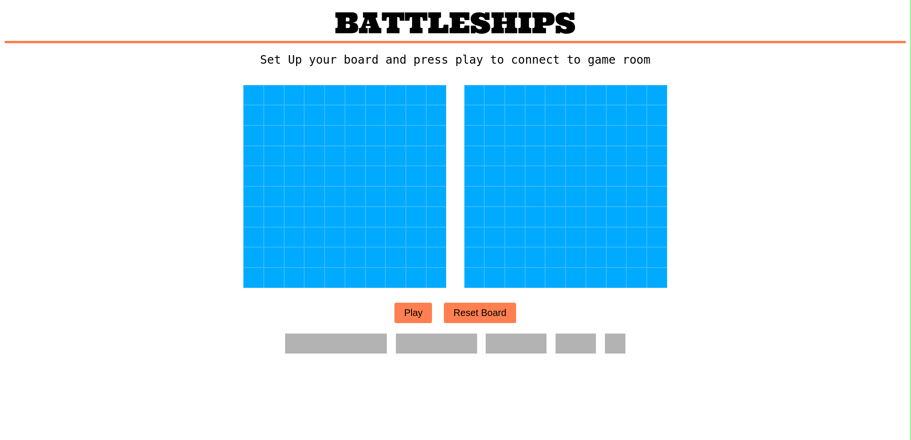
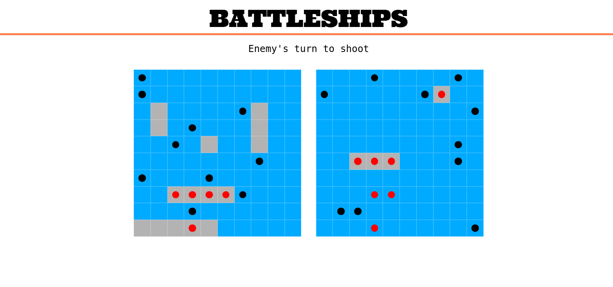

#BattleShips Game
 It is a logical web game of "Battleships". 
 
 
 The goal of the game is to sink all enemy ships 
The ships are placed on a 10x10 board. 
During move, the player checks the enemy fields one by one, until he misses, then the opponent makes a move. 
The game ends when one of the players finds and shoots all enemy ships. 
 The game consists of three parts: 
- frontend -> "frontend" subdirectory 
- backend -> "server" subdirectory 
- dynamic-link library in c++ -> "libcpp" subdirectory 
 Information about each part, including information about compilation, requirements, and documentation, can be found in the "readme" files in the given subdirectories. 
